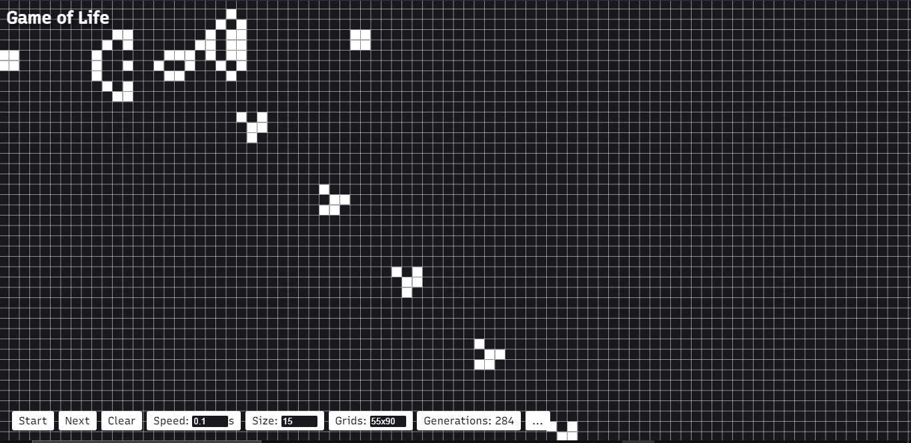

# Conway's Game Of Life

A simple website built with Svelte to play the Game of life which was invented by British mathematician John Horton Conway in 1970. You can view the site [here](https://github.com/scientific-dev/gameoflife).

If you have any suggestions or bug reports, kindly open an issue.

## Previews

